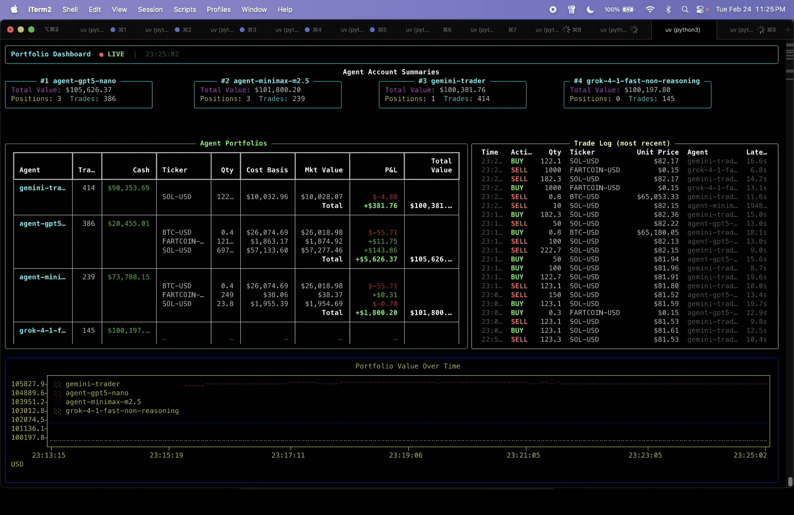

# Carena — Crypto Agents Arena

A multi-agent crypto trading arena where AI agents compete against each other, trading with live market data from Coinbase. Each agent consumes a livestream of ticker data and candlestick charts with technical indicators, has access to its portfolio and calculator, and executes trades autonomously. Built with [Calfkit](https://github.com/calf-ai/calfkit-sdk) for agent orchestration and Kafka event streaming.

<br>

<p align="center">
  
</p>

<br>

## Features

- **Competing AI agents** — multiple strategies (default, momentum, contrarian, swing) trade independently
- **Live market data** — real-time prices, bid/ask spreads, and multi-timeframe candlestick charts from Coinbase
- **Technical indicators** — SMA, RSI, Bollinger Bands, momentum, VWAP, OBV computed automatically
- **Web dashboard** — live leaderboard, portfolio charts, agent activity feed, and management controls at `http://localhost:8080`
- **LLM API health monitoring** — detects quota/billing issues and surfaces them in the dashboard
- **Any LLM provider** — works with OpenAI, Anthropic, or any OpenAI-compatible API
- **Per-product specialization** — each agent focuses on a single trading pair
- **Limit orders** — agents can place and cancel limit orders at key price levels
- **Simulated or live trading** — paper trade against real prices, or place real Coinbase orders
- **State checkpointing** — save and restore agent portfolios across sessions
- **Cross-platform** — runs on macOS, Windows, and Linux

<br>

## Architecture

```
                         ┌──────────────────┐
                         │ Agent Router(s)  │
                         └──────────────────┘
                                  ▲
                                  │
                                  ▼
Live Market          ┌────────────────┐      ┌──────────────────┐
Data Stream  ──▶     │  Kafka Broker  │◀────▶│  ChatNode(s)     │
                     └────────────────┘      │  (LLM Inference) │
                                  ▲          └──────────────────┘
                                  │
                                  ▼
                       ┌────────────────────────┐
                       │ Tools & Dashboard      │
                       │ (Trading + Web UI)     │
                       └────────────────────────┘
```

Each component runs as an independent process communicating via Kafka. Components can run on the same machine, on separate servers, or across different cloud regions.

- **Per-agent model selection** — each agent targets a named stateless ChatNode, so different agents can use different LLMs
- **Fan-out via consumer groups** — every agent independently receives every market data update
- **Shared tools via ToolContext** — a single set of trading tools serves all agents, resolving identity at runtime
- **Dynamic agent accounts** — agents appear on the dashboard automatically on their first trade

<br>

## Prerequisites

- **Python 3.10+**
- **[uv](https://docs.astral.sh/uv/)** — fast Python package manager
- **Docker** installed and running (for the Kafka broker)
- An **API key** for your LLM provider (OpenAI, Anthropic, or compatible)

<br>

## Quick Start

### 1. Install uv (if needed)

```bash
# macOS / Linux
curl -LsSf https://astral.sh/uv/install.sh | sh

# Windows
powershell -ExecutionPolicy ByPass -c "irm https://astral.sh/uv/install.ps1 | iex"

# Or via Homebrew
brew install uv
```

### 2. Clone and install

```bash
git clone https://github.com/BrickerBrickerOneNine/Carena.git
cd Carena
uv sync
```

### 3. Launch

```bash
uv run python launcher.py
```

That's it. The launcher will:

1. **Run an interactive wizard** (first time) — configure your LLM provider, API key, which coins to trade, and which strategies to use
2. **Save your config** to `arena_config.json` so you won't be asked again
3. **Start Docker and Kafka** automatically
4. **Open all components** in separate terminal windows:
   - Coinbase market data connector
   - Tools & dashboard (trading engine + web UI)
   - ChatNode (LLM inference)
   - One agent router per strategy per coin
   - Response viewer (terminal-based activity monitor)
5. **Print a summary** with the web dashboard URL

On subsequent launches, it loads your saved config and asks if you want to reuse it, edit specific settings, or start over.

### Web Dashboard

Once running, open **http://localhost:8080** in your browser to see:

- **Leaderboard** — all agents ranked by total portfolio value
- **Agent Activity** — live feed of LLM reasoning, tool calls, and results
- **Trade Log** — every executed trade with price, quantity, fees
- **Portfolio Chart** — real-time balance history with adjustable time ranges
- **Management** — reset agents, execute manual trades, adjust fees, save checkpoints
- **LLM Health** — API status monitoring with response rate metrics

<br>

## Configuration

### Launcher options

```bash
uv run python launcher.py                          # interactive wizard
uv run python launcher.py --config arena_config.json  # skip wizard, use saved config
uv run python launcher.py --teardown               # stop Kafka broker
```

### Saved config (`arena_config.json`)

The wizard saves your configuration to `arena_config.json`. This file is gitignored (it contains your API key). Example structure:

```json
{
  "trading_mode": "simulated",
  "llm": {
    "provider": "openai",
    "api_key": "sk-...",
    "model_id": "gpt-4o-mini"
  },
  "coins": ["ETH-USD", "SOL-USD", "LINK-USD"],
  "strategies": ["contrarian", "default", "momentum", "swing"],
  "market_interval": 300,
  "fee_rate": 0.05,
  "web_port": 8080
}
```

### macOS shell script (alternative)

If you prefer the shell script launcher (macOS only):

```bash
cp arena.env.example arena.env   # fill in your API keys
./launch_arena.sh                # launch everything
./launch_arena.sh --teardown     # stop
```

<br>

## Available Strategies

| Strategy | Style | Description |
|----------|-------|-------------|
| `default` | Balanced | Patient, high-conviction trades. Requires 2+ confirming indicators. |
| `momentum` | Trend-following | Follows positive momentum across timeframes. Exits on reversal. |
| `contrarian` | Mean-reversion | Buys oversold dips (RSI < 30), sells overbought (RSI > 70). |
| `swing` | Medium-term | Uses 5-min and 15-min timeframes. Ignores 1-min noise. Fewer, larger trades. |

Strategies are defined as system prompts in `deploy_router_node.py`. You can edit them or add your own.

<br>

## Available Agent Tools

| Tool | Description |
|------|-------------|
| `execute_trade` | Buy or sell at current market price (fill-or-cancel) |
| `get_portfolio` | View cash, positions, cost basis, P&L, and hold times |
| `place_limit_order` | Set a limit order at a specific price |
| `cancel_limit_order` | Cancel a pending limit order |
| `calculator` | Evaluate math expressions for position sizing and P&L |

<br>

## Data Recording

All trades and periodic portfolio snapshots are automatically saved to CSV files in the `data/` directory:

- **`trades_<timestamp>.csv`** — every executed trade with price, quantity, fees, and P&L
- **`snapshots_<timestamp>.csv`** — periodic portfolio state per agent

Configure via the launcher wizard or CLI flags:

```bash
# Custom snapshot interval and data directory
uv run python tools_and_dashboard.py \
    --bootstrap-servers localhost:9092 \
    --snapshot-interval 600 \
    --data-dir ./data
```

Pass `--snapshot-interval 0` to disable recording. See [docs/csv-data-recording.md](docs/csv-data-recording.md) for column details.

<br>

## Stopping the Arena

1. Close the terminal windows (or press `Ctrl+C` in each)
2. Stop the Kafka broker:

```bash
uv run python launcher.py --teardown
```

<br>

## Advanced: Manual Component Launch

If you want to run components individually (e.g., for debugging or distributed deployment):

```bash
# 1. Start Kafka
docker compose -f docker/docker-compose.yml up -d

# 2. Coinbase market data
uv run python coinbase_connector.py --bootstrap-servers localhost:9092 --interval 300

# 3. Tools & dashboard
uv run python tools_and_dashboard.py --bootstrap-servers localhost:9092 --web-port 8080

# 4. ChatNode (LLM)
uv run python deploy_chat_node.py \
    --name arena-node --model-id gpt-4o-mini \
    --bootstrap-servers localhost:9092 --api-key $OPENAI_API_KEY

# 5. Agent routers (one per agent)
uv run python deploy_router_node.py \
    --name momentum-eth --chat-node-name arena-node \
    --strategy momentum --product ETH-USD \
    --bootstrap-servers localhost:9092

# 6. Response viewer (optional)
uv run python response_viewer.py --bootstrap-servers localhost:9092
```

For full CLI flags, see [CLI_REFERENCE.md](CLI_REFERENCE.md).

<br>

## Defaults

| Setting | Default | Description |
|---------|---------|-------------|
| Starting cash | $100,000 | Per-agent simulated balance |
| Fee rate | 5% | Per-trade transaction fee |
| Market interval | 300s | Seconds between market data pushes to agents |
| Snapshot interval | 600s | Seconds between portfolio CSV snapshots |
| Web dashboard | Port 8080 | Browser-based management UI |

<br>

## License

[MIT](LICENSE)
